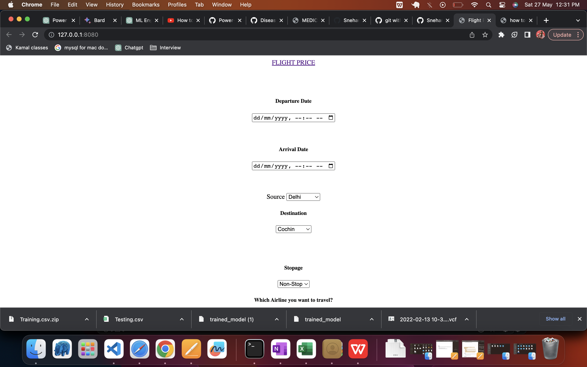

# FlightPricePredictor

Flight Price Predictor
The Flight Price Predictor is a web application designed to provide users with estimated flight prices based on various parameters. By utilizing machine learning algorithms, the app predicts flight prices and assists users in making informed decisions about their travel plans.

Getting Started
To access the application, follow these steps:

Visit the Flight Price Predictor web app.
On the homepage, you will find input fields to enter the departure date and time, source and destination airports, number of stops, and preferred airline for your travel.
Use the calendar-control/date-picker to select the desired departure date and time.
Choose the source and destination airports from the dropdown options, which display a list of available locations.
Select the number of stops for your flight from the dropdown, ranging from non-stop to a maximum of four stops.
Choose the preferred airline for your travel from the dropdown, which provides a list of available airlines for the selected route.
Once you have entered all the required information, click on the "Submit" button to proceed.

1. MainePage 

